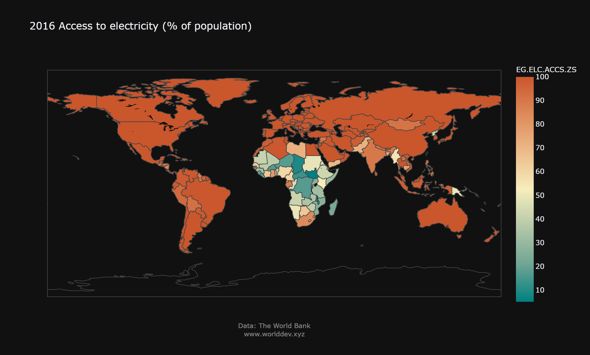
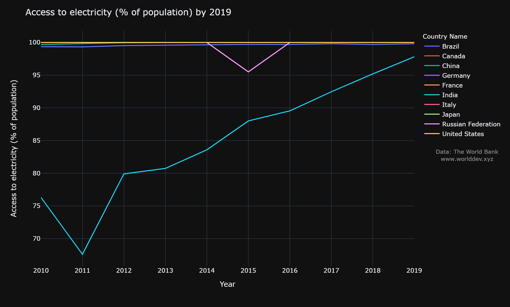
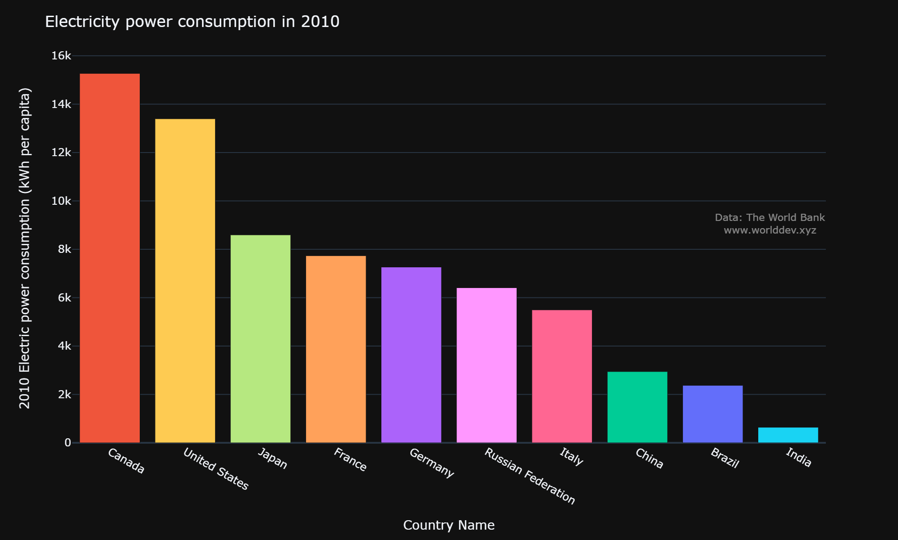
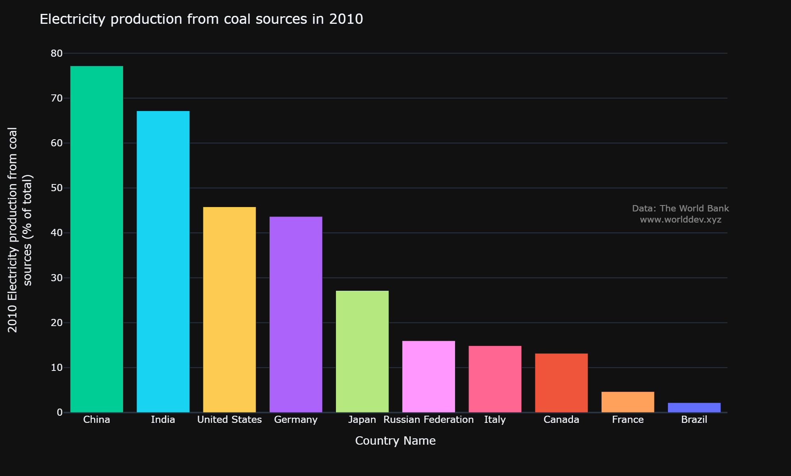
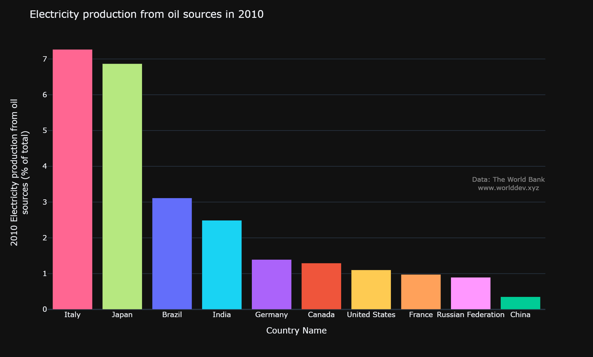
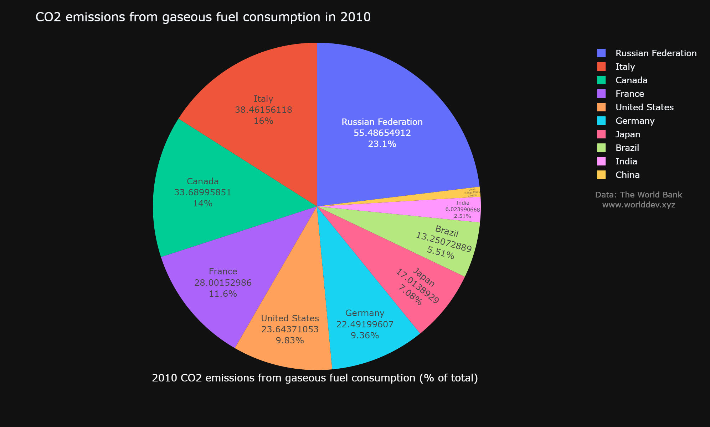
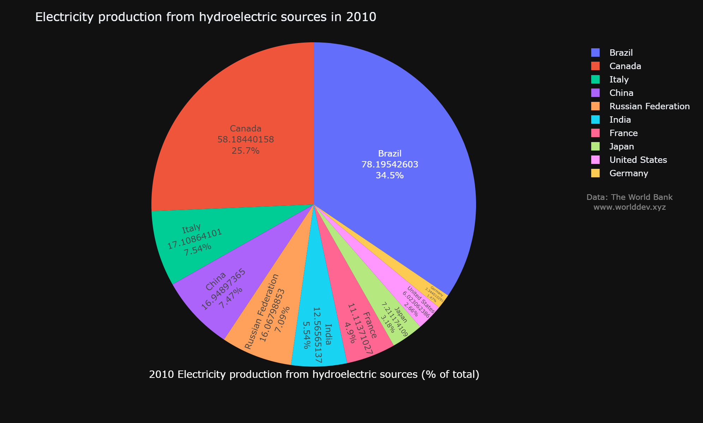
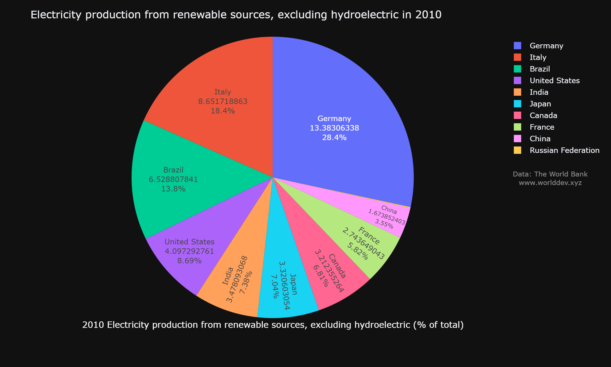

# **The world is moving towards Renewable Energy**

- Alisha Minj
- Data Science Master's Student, UMBC

## Topic:

-	Environment
-	Energy & Mining
-	Climate Change

## Countries:

-	United States 
- Brazil
-	Canada
-	China 
-	France
-	Germany
-	India
-	Italy
-	Japan
-	Russia

## Introduction:

More people are using electricity than ever before as an essential part of modern life. The use of energy is important for operating all appliances, entertainment, and technology. Global energy consumption has increased the individual’s standard of living. But electricity generation is damaging the environment. Electricity in most countries is generated by coal, natural gas, and nuclear energy. They all emit CO2 and other emissions when burned. Carbon emissions are dangerous to humans, the planet, and our future. As non-renewable resources, they have limited supply and cannot be sustained. Therefore, many countries are moving towards renewable sources such as hydropower, biomass, wind, geothermal and solar power. Providing clean and reliable power supplies that will help conserve the resources.

## Access to Electricity

Globally access to electricity has been steadily rising over the decades and has begun to accelerate in developing countries. By 2016, the majority of the world population had access to electricity. Access to electricity indicates the social and economic growth of the country. And an undistorted indication of a country’s energy power status.

Developed countries have an electrification rate of 100%. The countries United States, China, Germany, Canada, France, Italy, Brazil, Japan has 100% accessibility over the years. There was a slight drop in 2015 as Russia regained its full accessibility. Most member countries of the more developed Organization for Economic Cooperation and Development (OECD), such as the United States, and Japan, have shifted from manufacturing economies toward service economies. Developing countries like India increased from 77% in 2010 to almost 98% in 2019.

Over the years, the population will increase demand, which will also require an increase in supply. Access to electricity amongst these countries’ citizens are the different USA and China being economically strong have reached 100%, while only 98% Indian population has access to electricity which is rapidly increasing to 100% as well.

## Electric Power Consumption

Consumption of energy is highest in developed countries and countries with higher populations. Even though there is an immense difference in the population of these countries, the electricity consumption between them is not the same. In 2010, Canada has the highest consumption rate of around 15000 kWh per capita, followed by the United States with the 13500-kilowatt hour. Majority of countries utilized electric power between 5000 to 9000 kWh including Japan, France, Germany, Russia, and Italy. Most populated countries China and India only consumed 3000 and around 1000 kilowatt-hour. However, the world's electricity consumption has continuously grown over the past half-decade, reaching approximately 23,900 terawatt-hours in 2019.

## Production of electricity

Over the past century, the main energy sources used for generating electricity have been fossil fuels, natural gas, and, oil sources. The earth contains only a limited supply of each of these resources, and there is no way to produce more of them once we deplete our natural deposits.
 
## Non-Renewable Energy - Coal

Non-renewable energy sources diminish over time and are not able to replenish themselves. Most non-renewable energy sources are fossil fuels: coal, petroleum, and natural gas. The primary fossil fuel is used for the production of electricity is coal, which is comparatively cheap to obtain, transport, and handle. Coal is a solid fossil fuel that is used for heating homes and generating power plants. China and India are the highest producers of electricity by coal. Brazil uses much lower amounts of coal for its electricity production needs compared to other countries.

## Natural Gases and Oil

Italy has the highest production of electricity using both natural gases and oil, in 2010 as compared to other countries. 

Natural gas is relatively inexpensive to extract and is a cleaner fossil fuel than oil or coal. Italy and Russia produce 50 percent of total electricity from natural gas. Followed by Japan and United States, using between 20 to 30 percent. On the contrary, China produces the least amount. When natural gas is burned, it only releases carbon dioxide and water vapor.

With regards to, electricity produced from oils is the least used by all countries only under seven percent in total. However, Italy and Japan use around 7% to generate electricity, followed by Brazil and India. Other countries use below one percent of oil for production.

## CO2 Emissions from gaseous fuel consumption

Carbon dioxide is released into the atmosphere when fossil fuels are burned. Carbon emissions affect the planet significantly, as they are the greenhouse gas with the highest levels of emissions in the atmosphere. This causes global warming and ultimately, climate change. In 2010, Russia released the maximum with 23% for carbon, followed by Italy and Canada with 16% and 14%. Brazil, India, and China have an emission rate of less than 6%.

## Renewable Energy

Countries are switching to clean energy to tackle climate change. Solar, wind, and hydro are renewable and carbon-free, and effectively inexhaustible. Nonrenewable sources began replacing most of renewable energy use in many countries in the early 1800s, and by the early-1900s, fossil fuels were the main sources of energy. 

## Hydroelectric sources

Hydroelectric sources are the best renewable sources of energy that we can have and amongst them Brazil has the highest production capabilities with 78.1% of their total power coming from hydroelectric power plants. Canada is the second-highest producer with 58%. Followed by Italy, China, and Russia at around 7% production. Germany Has the least with less than 2%. hydropower does not generate emissions and is very consistent and reliable in most locations. 

## Other Renewable Sources

Solar and wind energy are that it is relatively predictable and reliable, it is effectively limitless. Biomass is renewable and carbon-neutral; it is also possible to use biomass unsustainably by harvesting it. Electricity produced among these countries using renewable sources apart from hydroelectricity is considerably higher than other means; Also, In this case, Germany produces 28.4% of its total electricity from other renewable sources. While Italy follows with 18.4% and Brazil with 13.8% while China has 3.55% of its total electric production via other means of sources apart from hydroelectric sources.

## Conclusion

To conclude, the production and consumption of electricity are indirectly proportional to the pollution created by that country. We see that more a country relies on fossil fuels to meet its energy demands, the more it contributes to pollution created. To cope with this, the best way to go about this is by shifting their energy production to renewable sources. However, they too pose challenges with regards to initial investment and other constraints. Even though nuclear fuel is an option that can be considered, it is both expensive and a hassle to maintain for any country, even more so to developing nations. The challenges with regards to the mining of fossil fuels and the consequent pollution from them is indeed a reality that need to be addressed by us.

